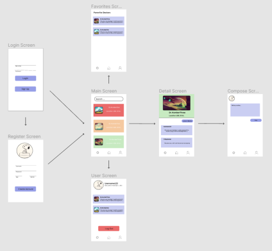

# DrSearch

## Table of Contents
1. [Overview](#Overview)
1. [Product Spec](#Product-Spec)
1. [Wireframes](#Wireframes)
2. [Schema](#Schema)

## Overview
### Description
[Description of your app]
An Android Mobile App where users can search, review, and recommend doctors in their area.

### App Evaluation
[Evaluation of your app across the following attributes]
- **Category:**
Heath 
- **Mobile:** 
The apps development will be focused on mobile, however future developments hopes to expand this toward desktop. Most likely mobile will have more features than that of the desktop.

- **Story:**
People can search for a doctor via a google API that then displays local doctors within the general location. Clicking on a doctor displays contact information, address and comments about this individual. Also allows for users to comment on the doctor selected and give them a rating from 1 through 5. 

- **Market:**
All individuals, especially those who are in need of a doctor.

- **Habit:**
The app intends to be used for whenever a user needs a medical examiner or perhaps one is searching for a new/replacement for a medical examiner. 

- **Scope:**
First we could start by developing a page where people are able to connect with medical examiners, along with some ratings. Future development would include ways to prevent bots and false ratings from appearing plus a gamified way for medical examiners to be the first result when users are searching for one. 

## Product Spec

### 1. User Stories (Required and Optional)

**Required Must-have Stories**

Login Screen (User name, Password, and application logo)
Registration Screen (Username, Password, Age, Phone Number)
User Screen a.k.a Profile Page (Will have username and favorite/ active doctors)
Main Screen (Include buttons to favorite, see details)(includes search for doctors)(ideally will have ratings for each doctor along with reviews) (Will include Doctor address, Doctors Name)
Favorites Screen (The page will include doctors favorited by the user)
Details Screen (Will provide further information about the doctor)
Compose Screen (Enables user to write a review)

**Optional Nice-to-have Stories**
Have an email requirement for registrations
The main screen should also include the Doctors phone number
Details Screen will include hours of operation/rating/ and reviews.
Doctors Nearby option
Have a google maps interface
Rate doctors based on user experience

### 2. Screen Archetypes

* Login Screen
   * When first opening the app, it prompts users to log in or create an account
   * After logging in for the first time, create persistence after logging in
* Register Screen
   * Allows users without accounts to create an account
   * Allow users to upload their profile image
* Stream Screen
   * Allows users to search for doctors by distance (10, 25, 50, 100 miles) from current location
   * Allows users to search by keywords (ex. primary care physician, orthodontist)
* Detail Screen
   * Allows users to read more information about a specific doctor
   * Renders reviews of specific doctor from other users
* Creation Screen
   * Allows users to write a review about their experience with a doctor
* Profile Screen
   * Allows users to see their user information (ex. username, join date, profile image)
   * Allows users to see past reviews they have written
   * Allows users to log out of application

### 3. Navigation

**Tab Navigation** (Tab to Screen)

* Profile
* Search/Reviews
* Favorites 

**Flow Navigation** (Screen to Screen)

* Forced Log-in -> Account creation if no login is available
* Main/Search -> Detail Screen -> comment/compose
* Main/Search -> User screen
* Main/Search -> Favorites 

## Wireframes
[Add picture of your hand sketched wireframes in this section]

### [BONUS] Digital Wireframes & Mockups

### [BONUS] Interactive Prototype

## Schema 
[This section will be completed in Unit 9]

### Models
[Add table of models]

### Networking
- [Add list of network requests by screen ]
- [Create basic snippets for each Parse network request]
- [OPTIONAL: List endpoints if using existing API such as Yelp]

